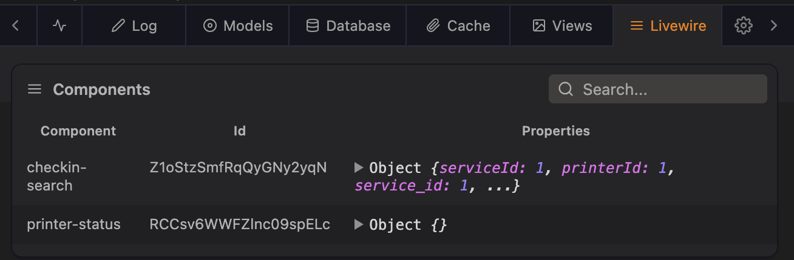
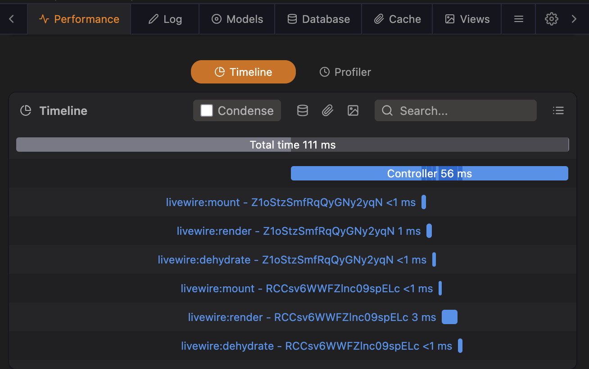

# Laravel Livewire data source for Clockwork

## Features

### New tab with table of rendered components


### Livewire events added to timeline


## Getting started

1. Require the package via composer
    ```bash
    composer require --dev hmazter/clockwork-livewire-data-source
    ```
2. The service provider is automatically registered
3. You are good to go

## Usage
Render a page containing a Livewire component, and you should see the component listed in the Clockwork UI, in the new Livewire tab.
You should also see timing info about the events in the timeline, when and how long each mount/render/etc took.

### Livewire events and arguments

These are the events that Livewire dispatches and the attributes for each event

- `mount` - component, params, key, parent
- `render` - component, view, properties
- `call` - root, method, params, context, returnEarly
- `update` - component, path, value
- `hydrate` - component, memo, context
- `dehydrate` - component, context
- `destroy` - component, context
- `profile` - event, id, timings(start, finish) - (only dispatched with `app.debug = true`)

#### Loading a page with a Livewire component
- mount
- render
- dehydrate

#### Updating a model in a Livewire component
- hydrate
- update
- render
- dehydrate

#### Call a method on a Livewire component
- hydrate
- call
- render
- dehydrate